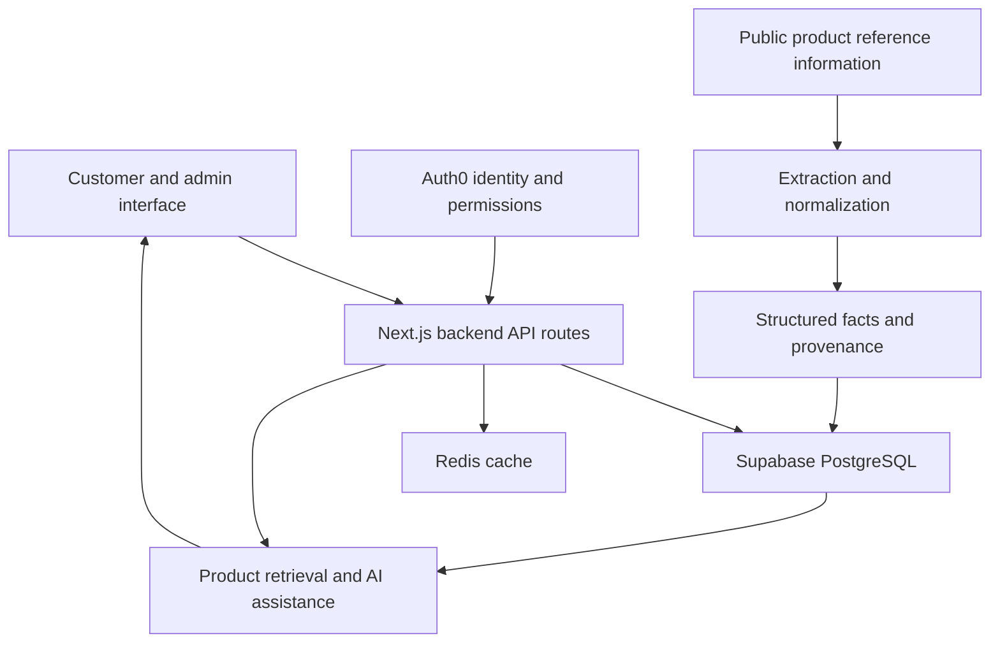

# FASTLANE

**An AI-integrated electric-vehicle commerce platform, connecting product discovery with catalog, inventory, order, and reservation workflows.**

This is **Pham Quang Dung's public portfolio showcase** for FASTLANE. It explains the project, my contributions, the application architecture, and selected testing practices. The application implementation is maintained separately; this repository contains documentation.

## What the project does

FASTLANE combines electric-vehicle and accessory discovery with the workflows needed to act on a purchase decision:

- Browse products and variants, compare vehicles, and find relevant product information.
- Manage catalog, inventory, carts, and orders through backend APIs and relational data models.
- Support showroom, reservation, and test-drive workflows.
- Retrieve structured product facts for AI-assisted discovery and answers.
- Extract and normalize public vehicle specifications while controlling which sources and fields are used.

## My contributions

**Pham Quang Dung — full-stack development and AI integration**

- Built catalog, inventory, cart, order, and reservation workflows with backend APIs and relational data models.
- Integrated AI-assisted product retrieval into the application.
- Worked on extracting and normalizing public vehicle facts from semi-structured information.
- Used source allowlists, filtering of sensitive fields, and Vitest regression checks to validate structured outputs.

These contributions reflect the project work described in my CV. The application-wide architecture and test coverage below describe the shared system; they do not imply sole authorship of every component. See [contributions](docs/contributions.md).

## Architecture at a glance

The application uses **Next.js 15, React 19, TypeScript, Supabase/PostgreSQL, Auth0, Redis, OpenAI integration, and Vitest**. API contracts are documented with OpenAPI. The shared stack is described in the [architecture overview](docs/architecture.md).

## Engineering focus

The AI work depends on useful, controlled inputs: product facts need consistent units, source context, and a way to handle ambiguity. The commerce workflows need their own validation around identity, inventory, and state changes. Tests distinguish those concerns rather than relying on a single end-to-end success claim.

Selected test definitions in the implementation cover fact normalization, conflicting observations, missing schemas, and fallback behavior. See [testing and evidence](docs/testing.md) for the reviewed cases and the limits of this showcase review.

No application test-pass count, model-accuracy metric, or production benchmark is claimed by this repository. The private application's test suite was not executed to prepare this documentation.

## Recruiter guide

1. Read [my contributions](docs/contributions.md) for the work described in my CV.
2. Review [architecture](docs/architecture.md) for the commerce and AI data flows.
3. Review [testing](docs/testing.md) for specific engineering concerns supported by test definitions.

Maintained by [Pham Quang Dung / PQDReal](https://github.com/PQDReal). The application was developed with project collaborators and is maintained separately. This showcase does not provide a runnable application or grant a license to the original implementation, product assets, or source datasets.
