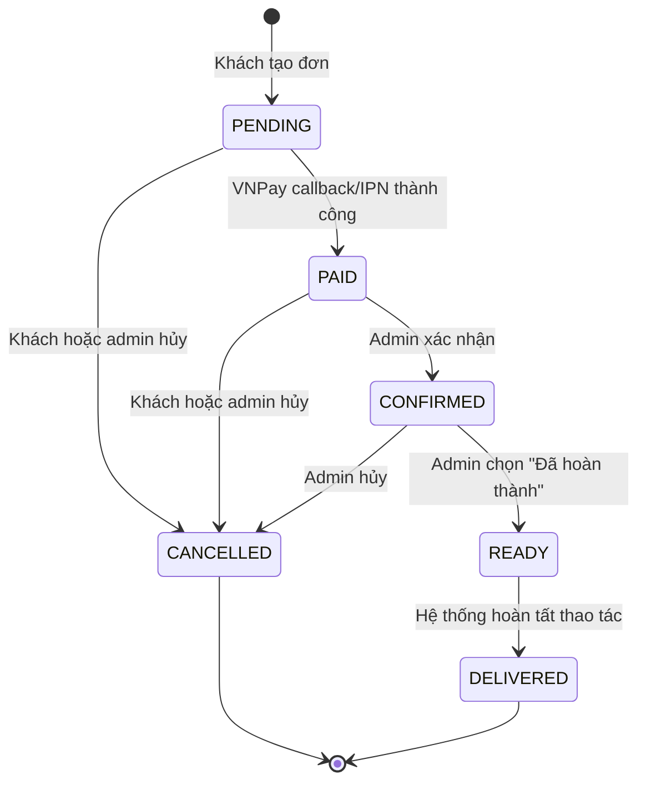
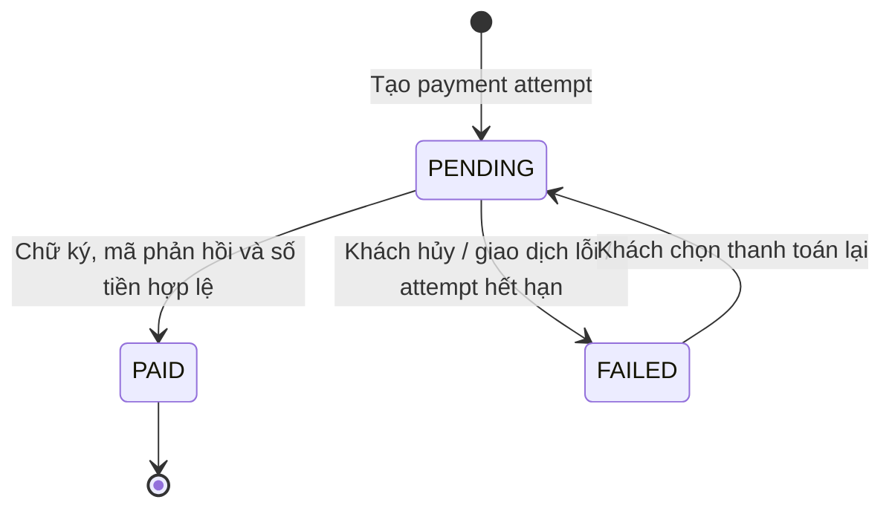
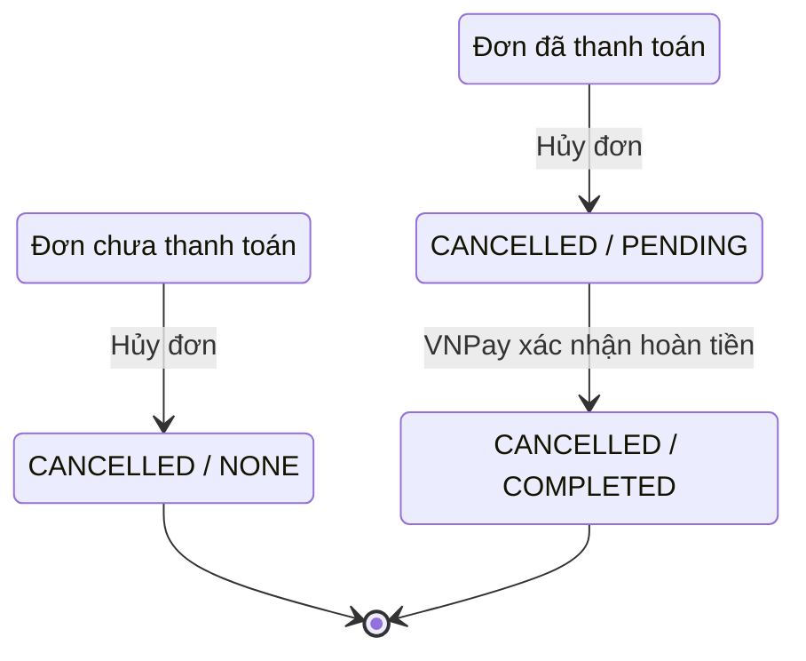
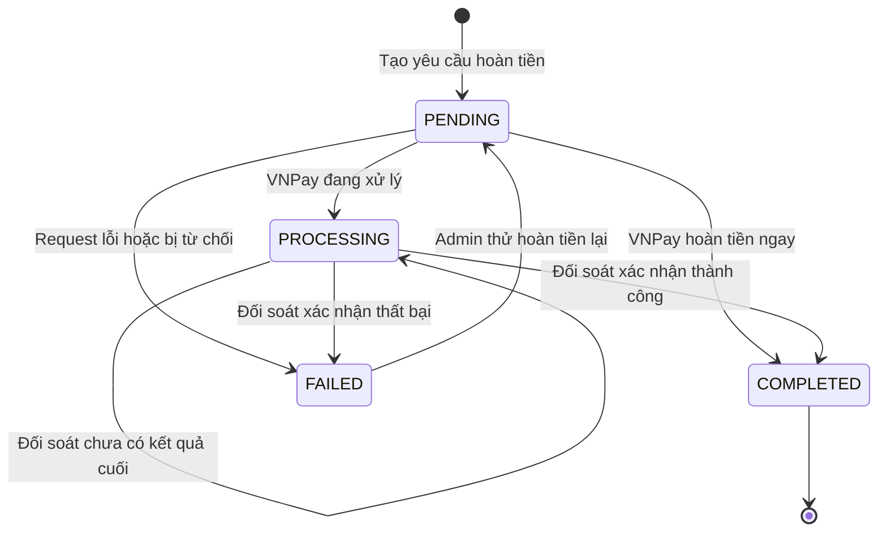

# State flow đơn hàng phụ kiện

Tài liệu này mô tả luồng trạng thái **đơn hàng phụ kiện** đang được triển khai trong dự án. Ba nhóm trạng thái được lưu riêng:

- `orders.status`: vòng đời xử lý đơn hàng.
- `vnpay_checkout_attempts.status`: trạng thái từng lần thanh toán VNPay.
- `orders.refund_status` và `vnpay_refund_attempts.status`: trạng thái hoàn tiền.

## 1. Vòng đời đơn hàng



### Ý nghĩa trạng thái

| Trạng thái | Nhãn giao diện | Ý nghĩa | Hành động hợp lệ |
|---|---|---|---|
| `PENDING` | Chờ thanh toán | Đơn đã tạo nhưng VNPay chưa xác nhận thanh toán | Thanh toán, thanh toán lại, hủy |
| `PAID` | Đã thanh toán | VNPay đã xác nhận giao dịch | Admin xác nhận hoặc hủy |
| `CONFIRMED` | Đã xác nhận | Admin đã tiếp nhận đơn | Đánh dấu hoàn thành hoặc hủy |
| `READY` | Sẵn sàng giao | Trạng thái trung gian trước khi giao | Chuyển sang đã giao |
| `DELIVERED` | Đã giao | Đơn đã hoàn tất giao hàng | Không còn thao tác |
| `CANCELLED` | Đã hủy / Đang chờ hoàn tiền | Đơn đã dừng xử lý | Có thể hoàn tiền nếu đơn đã thanh toán |

> Hiện tại thao tác admin `complete` chuyển `CONFIRMED → READY → DELIVERED` trong cùng một request. Vì vậy người dùng thường chỉ nhìn thấy kết quả cuối là `DELIVERED`.

## 2. Luồng thanh toán VNPay



Khi một payment attempt chuyển sang `PAID`, hệ thống đồng thời chuyển đơn hàng:

```text
orders.status: PENDING → PAID
```

Điều kiện xác nhận thanh toán:

1. Chữ ký VNPay hợp lệ.
2. `vnp_TmnCode` đúng merchant.
3. `vnp_TxnRef` tồn tại.
4. Số tiền phản hồi khớp số tiền của attempt.
5. `vnp_ResponseCode = 00`.
6. `vnp_TransactionStatus = 00`.

Return URL phục vụ điều hướng giao diện; IPN server-to-server mới là nguồn phù hợp để cập nhật giao dịch độc lập với trình duyệt khách hàng.

## 3. Hủy đơn và hoàn tiền

Việc hủy luôn đưa `orders.status` về `CANCELLED`, nhưng `refund_status` phụ thuộc đơn đã thanh toán hay chưa.



### Luồng refund attempt



Khi refund attempt đạt `COMPLETED`, hệ thống cập nhật:

```text
orders.status:        CANCELLED (giữ nguyên)
orders.refund_status: PENDING → COMPLETED
```

Trong lúc attempt là `PENDING` hoặc `PROCESSING`, giao diện hiển thị **Đang chờ hoàn tiền** và tự động đối soát VNPay định kỳ.

### Chế độ kiểm thử Sandbox

VNPay Sandbox có thể giữ refund ở trạng thái `05` hoặc `06` mà không mô phỏng bước ngân hàng hoàn tất. Có thể bật:

```env
VNPAY_SANDBOX_AUTO_COMPLETE_REFUNDS=true
```

Khi bật, hệ thống chỉ mô phỏng hoàn tất nếu API URL thực sự thuộc `sandbox.vnpayment.vn`, chữ ký hợp lệ, response code là `00`, loại giao dịch là refund (`02`/`03`) và trạng thái là `05` hoặc `06`. Cấu hình này không được sử dụng ở production VNPay.

## 4. Ma trận chuyển trạng thái hợp lệ

| Từ trạng thái | Hành động | Sang trạng thái | Refund |
|---|---|---|---|
| `PENDING` | VNPay thanh toán thành công | `PAID` | `NONE` |
| `PENDING` | Hủy đơn | `CANCELLED` | `NONE` |
| `PAID` | Admin xác nhận | `CONFIRMED` | `NONE` |
| `PAID` | Hủy đơn | `CANCELLED` | `PENDING` |
| `CONFIRMED` | Admin hoàn thành | `READY`, sau đó `DELIVERED` | `NONE` |
| `CONFIRMED` | Admin hủy | `CANCELLED` | `PENDING` |
| `READY` | Hoàn tất giao | `DELIVERED` | `NONE` |
| `CANCELLED` + refund `PENDING` | VNPay hoàn tiền thành công | `CANCELLED` | `COMPLETED` |

Các chuyển trạng thái ngoài ma trận phải trả HTTP `409` với mã `INVALID_ORDER_TRANSITION` hoặc mã nghiệp vụ tương đương.

## 5. Điểm kết thúc

- `DELIVERED`: đơn đã giao thành công.
- `CANCELLED` + `refund_status = NONE`: đơn chưa thanh toán đã hủy, không cần hoàn tiền.
- `CANCELLED` + `refund_status = COMPLETED`: đơn đã hủy và đã hoàn tiền.
