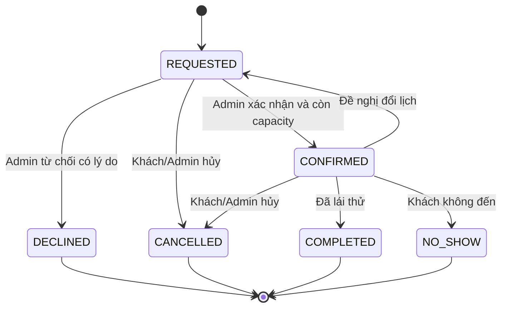

# FASTLANE — Business Rule Catalog cho hành trình trước mua

> Trạng thái: Bản nháp phục vụ PO/BA review
> Phiên bản: 0.2.0-draft
> Ngày lập: 22/07/2026
> Phạm vi: Từ khám phá sản phẩm đến bàn giao cấu hình sang luồng đặt cọc
> Không thuộc phạm vi tài liệu: thay đổi PRD, OpenAPI, database, code hoặc chốt mức phí pháp lý thực tế
> Vị trí chia sẻ: `docs/agent/PREPURCHASE_BUSINESS_RULES.md`

## 1. Mục tiêu và nguyên tắc

Tài liệu này hợp nhất các hành vi trước mua đã có trong PRD, API contract, database, sequence diagram và prototype; đồng thời đặc tả các capability mới gồm showroom, yêu cầu lái thử, yêu cầu tư vấn, dự toán lăn bánh và trả góp.

Các nguyên tắc bắt buộc:

1. Không xem prototype là yêu cầu đã được PO duyệt.
2. Không xem OpenAPI `0.5.0-draft` là contract đã freeze.
3. Không tự hợp nhất các nguồn mâu thuẫn; mọi mâu thuẫn phải xuất hiện trong Gap Register.
4. Kết quả dự toán chỉ mang tính tham khảo, không phải báo giá hay cam kết cấp tín dụng.
5. Mọi giá, phí, ưu đãi và lãi suất đều do server tính từ dữ liệu có version; client không tự quyết định kết quả.
6. Checkout luôn định giá lại; dự toán trước mua không giữ giá, giữ tồn kho hoặc tạo quyền nhận ưu đãi.
7. MVP có đúng một địa điểm/showroom do server cấu hình; khách không chọn hoặc gửi `showroomId`. Tỉnh đăng ký xe dùng để tính phí lăn bánh là dữ liệu độc lập với địa điểm showroom.

### 1.1 Trong phạm vi

- Catalog, tìm kiếm, lọc, sắp xếp và chi tiết/cấu hình sản phẩm.
- So sánh xe và yêu thích ở mức phân loại roadmap.
- Hiển thị địa điểm showroom duy nhất và khả năng hỗ trợ mẫu xe.
- Gửi yêu cầu tư vấn.
- Gửi, theo dõi, đổi và hủy yêu cầu lái thử.
- Dự toán chi phí lăn bánh và lịch trả góp.
- Bàn giao lựa chọn sang luồng đặt cọc/checkout hiện hữu.
- Hành vi vận hành tương ứng của Admin.

### 1.2 Ngoài phạm vi

- Thanh toán thực tế, thẩm định hoặc phê duyệt khoản vay.
- Giá trị pháp lý cụ thể của thuế/phí/lãi suất tại một thời điểm.
- Lái thử tại nhà, sự kiện và nhiều mẫu xe trong cùng một lịch ở MVP.
- Tổng chi phí sở hữu dài hạn, bảo dưỡng, cứu hộ và hậu mãi.
- Thay đổi state machine của Order hoặc chính sách hoàn/hủy cọc.
- Tạo role `SHOWROOM_STAFF`; MVP tiếp tục dùng role `ADMIN`.
- Danh sách, tìm kiếm, lựa chọn hoặc CRUD nhiều showroom.

## 2. Thuật ngữ, trạng thái và nguồn

### 2.1 Actor

| Actor | Mô tả |
|---|---|
| Guest | Người dùng chưa đăng nhập; được xem catalog, dùng công cụ dự toán và gửi lead/lái thử. |
| Customer | Người dùng đã đăng nhập qua Auth0; có thể được liên kết với lead, lịch lái thử và cấu hình đã lưu. |
| Admin | Role vận hành hiện hữu; trong MVP quản lý cấu hình địa điểm duy nhất, lịch lái thử, lead và policy phí/lãi suất. |
| System | Backend, scheduler và các policy engine thực thi validation, tính toán và audit. |

### 2.2 Mức ưu tiên

| Priority | Ý nghĩa |
|---|---|
| Must | Bắt buộc cho MVP 5 tuần hoặc là dependency trực tiếp của capability Must. |
| Should | Có giá trị cao nhưng được phép lùi nếu ảnh hưởng mốc MVP. |
| Roadmap | Không triển khai trong MVP; chỉ giữ rule định hướng để tránh khóa kiến trúc. |

### 2.3 Trạng thái rule

| Trạng thái | Ý nghĩa |
|---|---|
| CONFIRMED | Được PRD/SRS hiện tại nêu rõ và không có mâu thuẫn trực tiếp trong cùng phạm vi. |
| INFERRED | Suy ra từ contract, database, sequence diagram hoặc prototype; cần PO/BA xác nhận. |
| PROPOSED | Quyết định mới của bản phân tích này; chưa trở thành nguồn sự thật của sản phẩm. |
| OPEN | Chưa đủ dữ kiện hoặc đang mâu thuẫn; không được implement như rule cuối cùng. |

### 2.4 Thứ tự dùng nguồn

Khi không mâu thuẫn, dùng thứ tự: PRD/SRS đã duyệt → OpenAPI đã freeze → database đã xác minh → sequence diagram → prototype → benchmark ngoài. OpenAPI hiện vẫn là draft nên các rule chỉ có ở OpenAPI không tự động được nâng thành `CONFIRMED`.

| Source ID | Nguồn |
|---|---|
| SRC-PRD | PRD/SRS Fastlane 1.0.0 đã được review trong workspace cục bộ; file nguồn chưa được theo dõi trong repository. |
| SRC-OAS | [OpenAPI review 0.5.0-draft](../../api-contract/OPENAPI_REVIEW.md) và contract trong `api-contract/` |
| SRC-DB | [Metadata database hiện tại](./DATABASE.md) |
| SRC-ARCH | [Kiến trúc hệ thống](./ARCHITECTURE.md) |
| SRC-SEQ | Sequence diagram đã được review từ workspace cục bộ; artifact nguồn chưa được theo dõi trong repository. |
| SRC-PROT-C | Customer flow prototype đã được review từ workspace cục bộ; artifact nguồn chưa được theo dõi trong repository. |
| SRC-PROT-TD | Customer test-drive prototype đã được review từ workspace cục bộ; artifact nguồn chưa được theo dõi trong repository. |
| SRC-PROT-A | Admin flow prototype đã được review từ workspace cục bộ; artifact nguồn chưa được theo dõi trong repository. |
| SRC-VF-TD | [VinFast — đăng ký lái thử](https://shop.vinfastauto.com/vn_vi/dang-ky-lai-thu.html) |
| SRC-VF-TD-G | [VinFast — hướng dẫn/quy định lái thử](https://vinfastauto.com/vn_vi/vn_vi/dang-ky-lai-thu-o-to-dien-vinfast-online) |
| SRC-VF-OR | [VinFast — dự toán chi phí lăn bánh](https://shop.vinfastauto.com/vn_vi/chi-phi-lan-banh) |
| SRC-VF-LN | [VinFast — dự toán trả góp](https://shop.vinfastauto.com/vn_vi/du-toan-chi-phi-tra-gop) |
| DEC-PLAN | Các quyết định đã được User chọn khi duyệt kế hoạch ngày 22/07/2026. |

> `Live update prototype.docx` chỉ chứa liên kết Figma. Phiên làm việc không truy cập được Figma, vì vậy không có rule nào được xác lập riêng từ liên kết này.

## 3. Bản đồ hành vi và ưu tiên

| Giai đoạn | Must | Should | Roadmap |
|---|---|---|---|
| Khám phá | Catalog, search, filter, sort, detail, variant, tồn kho hiển thị | So sánh tối đa 3 xe | Wishlist, gợi ý cá nhân hóa |
| Kết nối offline | Địa điểm cố định, giờ hoạt động, mẫu xe hỗ trợ | Chỉ đường/liên hệ nhanh | Nhiều showroom, bản đồ nâng cao, tồn kho theo showroom |
| Tư vấn | Gửi yêu cầu có consent và ngữ cảnh sản phẩm/dự toán | Theo dõi trạng thái lead | Chat trực tiếp, phân lead tự động |
| Lái thử | Guest request, một mẫu xe, tại showroom, Admin xác nhận | Tự đổi/hủy, lịch sử, nhắc lịch | Tại nhà/sự kiện, nhiều mẫu xe, check-in số |
| Dự toán | Lăn bánh theo địa phương, policy version, breakdown | Lưu/chia sẻ/tải kết quả | Total Cost of Ownership |
| Tài chính | Dự toán trả góp theo gói vay | So sánh nhiều gói vay | Thẩm định/pre-approval với đối tác |
| Chuyển đổi | Mang cấu hình sang đặt cọc và re-price | Khôi phục cấu hình đã lưu | Giữ giá/giữ xe theo chiến dịch riêng |

## 4. Business Rule Catalog

### 4.1 Khám phá và đánh giá sản phẩm

| BR-ID | Actor | Trigger | Điều kiện | Rule và kết quả | Ngoại lệ | Priority | Status | Source | Acceptance criteria |
|---|---|---|---|---|---|---|---|---|---|
| BR-DIS-001 | Guest/Customer | Mở catalog | Không | Chỉ hiển thị product đang active. | Product inactive không được trả trong public catalog. | Must | CONFIRMED | SRC-PRD, SRC-OAS | Given một product inactive, when gọi catalog, then product không xuất hiện. |
| BR-DIS-002 | Guest/Customer | Xem product/variant | Product active | Public chỉ trả variant active; variant active hết hàng vẫn hiển thị nhưng `isPurchasable=false`. | Không có variant active thì product không đủ điều kiện public theo policy draft. | Must | INFERRED | SRC-OAS, SRC-SEQ | Variant hết hàng hiển thị nhãn hết hàng và CTA mua bị khóa. |
| BR-DIS-003 | Guest/Customer | Nhập từ khóa | Từ khóa hợp lệ sau trim | Search theo tên product; tìm SKU được hỗ trợ theo PRD; kết quả chỉ gồm dữ liệu public. | Không có kết quả trả danh sách rỗng và gợi ý bỏ bớt filter. | Must | CONFIRMED | SRC-PRD, SRC-SEQ | Search tên/SKU đúng trả kết quả; keyword không khớp trả empty state. |
| BR-DIS-004 | Guest/Customer | Chọn filter | Catalog khả dụng | Hỗ trợ loại xe/category, khoảng giá và các thuộc tính được catalog công bố; các filter kết hợp theo AND. | Giá min lớn hơn max bị từ chối validation. | Must | CONFIRMED | SRC-PRD, SRC-PROT-C | Kết quả và tổng số item phản ánh đồng thời toàn bộ filter. |
| BR-DIS-005 | Guest/Customer | Chọn sort | Danh sách hiện tại | Hỗ trợ mới nhất, giá tăng và giá giảm; giữ nguyên filter/search hiện tại. | Sort key không hỗ trợ bị từ chối thay vì tự fallback. | Must | CONFIRMED | SRC-PRD | Đổi sort không làm mất filter và không tạo item ngoài tập kết quả. |
| BR-DIS-006 | Guest/Customer | Đổi trang | Query hợp lệ | Danh sách dùng server-side pagination; mặc định PRD là 20 item/trang nếu contract không override. | Page vượt tổng trả danh sách rỗng cùng metadata hợp lệ. | Must | CONFIRMED | SRC-PRD | Metadata tổng item/trang nhất quán với kết quả. |
| BR-DIS-007 | Guest/Customer | Mở chi tiết | Product public tồn tại | Hiển thị ảnh, thông số, variant/options, giá VND, điều khoản mua và khả năng mua. | Slug không tồn tại/inactive trả not found. | Must | CONFIRMED | SRC-PRD, SRC-OAS | Không hiển thị field quản trị hoặc giá/tồn do client tự suy ra. |
| BR-DIS-008 | System | Tính giá hiển thị | Variant active | `effectivePrice = salePrice` khi sale hợp lệ, ngược lại dùng `listPrice`; price range lấy từ effective price theo policy contract. | `salePrice >= listPrice` là invariant sai và không được publish. | Must | INFERRED | SRC-OAS | Giá list/detail/filter/sort dùng cùng một quy tắc effective price. |
| BR-DIS-009 | Guest/Customer | Chọn cấu hình | Product/variant public | Lựa chọn làm đổi SKU/tồn kho phải là variant; option không giữ tồn riêng chỉ cộng adjustment và phải tương thích SKU. | Thiếu option bắt buộc, chọn quá cardinality hoặc option không tương thích thì không cho tiếp tục. | Must | INFERRED | SRC-OAS | Cùng input cấu hình luôn tạo cùng selection payload và giá preview. |
| BR-DIS-010 | Guest/Customer | Thêm xe để so sánh | Product public | Cho so sánh tối đa 3 product/variant cùng product kind; hiển thị giá và nhóm thông số theo cùng đơn vị. | Xe thứ 4 bị chặn và yêu cầu bỏ một xe; dữ liệu thiếu hiển thị “Không có dữ liệu”. | Should | PROPOSED | DEC-PLAN, SRC-VF-TD-G | Không so sánh sai đơn vị hoặc tự điền giá trị thiếu. |
| BR-DIS-011 | Customer | Yêu thích sản phẩm | Đã đăng nhập | Wishlist thuộc roadmap; nếu triển khai phải gắn ownership user và không giữ tồn/giá. | Guest được mời đăng nhập hoặc lưu tạm cục bộ, không tạo record user ẩn. | Roadmap | PROPOSED | DEC-PLAN, SRC-PROT-C | Yêu thích không làm thay đổi availability hay promotion eligibility. |
| BR-DIS-012 | Guest/Customer | Xem ưu đãi | Promotion public/active | Chỉ trình bày ưu đãi đang hiệu lực và điều kiện chính; preview không bảo đảm ưu đãi còn hợp lệ ở checkout. | Không được hiển thị một promotion inactive/expired như đang áp dụng. | Must | INFERRED | SRC-PRD, SRC-OAS, SRC-PROT-C | CTA đặt cọc luôn kích hoạt revalidation promotion. |

### 4.2 Địa điểm/showroom duy nhất

| BR-ID | Actor | Trigger | Điều kiện | Rule và kết quả | Ngoại lệ | Priority | Status | Source | Acceptance criteria |
|---|---|---|---|---|---|---|---|---|---|
| BR-SHW-001 | Guest/Customer | Mở luồng lái thử | Không | Server trả đúng một địa điểm active cùng availability; không cung cấp danh sách/lọc showroom và không nhận `showroomId` từ client. | Địa điểm inactive làm capability lái thử tạm unavailable. | Must | PROPOSED | DEC-PLAN | Public request chứa `showroomId` bị từ chối unknown field. |
| BR-SHW-002 | Guest/Customer | Xem địa điểm | Địa điểm active | Hiển thị tên, địa chỉ hành chính, tọa độ nếu có, giờ hoạt động, hotline và mẫu xe hỗ trợ lái thử. | Thiếu tọa độ không được ngăn hiển thị địa chỉ dạng text. | Must | PROPOSED | SRC-PROT-TD, DEC-PLAN | UI hiển thị địa điểm cố định, không hiển thị control chọn showroom. |
| BR-SHW-003 | System | Lập lịch lái thử | Địa điểm và product active | Chỉ cho chọn mẫu xe nằm trong danh sách hỗ trợ của địa điểm singleton. | Mapping inactive hoặc hết hiệu lực làm mẫu xe không khả dụng cho lịch mới. | Must | PROPOSED | SRC-PROT-TD, SRC-VF-TD-G, DEC-PLAN | Không thể gửi request cho xe không được địa điểm duy nhất hỗ trợ. |
| BR-SHW-004 | System | Tạo slot khả dụng | Có lịch hoạt động | Slot phải nằm trọn trong giờ mở cửa, không thuộc blackout và có capacity dương. Dùng timezone `Asia/Ho_Chi_Minh`. | Ngày nghỉ/blackout không sinh slot. | Must | PROPOSED | DEC-PLAN | Không sinh slot giao nhau hoặc vượt ngoài giờ mở cửa. |
| BR-SHW-005 | Admin | Sửa cấu hình địa điểm | Có quyền Admin | Admin quản lý singleton settings gồm tên, địa chỉ, giờ làm việc, blackout, model hỗ trợ và capacity; không có CRUD danh sách showroom; mọi mutation có optimistic version và audit. | Không cho deactivate nếu còn lịch `CONFIRMED` trong tương lai mà chưa xử lý. | Must | PROPOSED | DEC-PLAN, SRC-OAS | Update version stale bị conflict; thay đổi hợp lệ không xóa lịch sử. |
| BR-SHW-006 | System | Đọc dữ liệu cũ | Cấu hình địa điểm đã thay đổi | Lịch/lead đã tạo giữ snapshot tên và địa chỉ cần thiết để audit. | Không dùng settings mới để viết lại lịch sử. | Must | PROPOSED | SRC-OAS | Record lịch sử vẫn đọc được sau khi địa điểm đổi tên/địa chỉ. |

### 4.3 Yêu cầu tư vấn

| BR-ID | Actor | Trigger | Điều kiện | Rule và kết quả | Ngoại lệ | Priority | Status | Source | Acceptance criteria |
|---|---|---|---|---|---|---|---|---|---|
| BR-LEAD-001 | Guest/Customer | Gửi yêu cầu tư vấn | Họ tên, điện thoại hợp lệ và consent xử lý dữ liệu | Tạo lead `NEW`; email là tùy chọn nếu kênh liên hệ chính là điện thoại. | Payload invalid không tạo lead một phần. | Must | PROPOSED | SRC-VF-OR, DEC-PLAN | Thành công trả mã tham chiếu và thông báo thời gian phản hồi không mang tính cam kết SLA nếu chưa cấu hình. |
| BR-LEAD-002 | Guest/Customer | Gửi từ product/estimate | Context đang hợp lệ | Snapshot source page, product/variant/options, địa điểm singleton và estimate reference/version nếu có. | Không tin giá do client gửi; không nhận showroom/location từ client; chỉ lưu reference hoặc server snapshot. | Must | PROPOSED | DEC-PLAN | Admin nhìn thấy đúng ngữ cảnh dẫn tới yêu cầu. |
| BR-LEAD-003 | System | Nhận lead | Có số điện thoại chuẩn hóa | Gắn user khi identity đã xác minh; guest vẫn tạo lead không cần tài khoản. | Không tự gắn user chỉ vì email/phone trùng nếu chưa có cơ chế xác minh. | Must | PROPOSED | DEC-PLAN | Guest và Customer đều gửi được, không lộ dữ liệu user khác. |
| BR-LEAD-004 | System/Admin | Xử lý lead | Lead tồn tại | Trạng thái đề xuất: `NEW → CONTACTED → QUALIFIED → CLOSED`; cho `NEW/CONTACTED → DUPLICATE`. Mọi transition có actor, thời gian và note. | Transition ngược không có lý do bị chặn. | Should | PROPOSED | DEC-PLAN | Timeline không bị ghi đè khi cập nhật trạng thái. |
| BR-LEAD-005 | System | Phát hiện spam/trùng | Cùng phone và context trong cửa sổ chống trùng cấu hình | Có thể trả lại lead active thay vì tạo mới; không dùng dedupe để tiết lộ lead của người khác. | Khác product hoặc yêu cầu mới sau cửa sổ cho phép tạo lead mới. | Should | PROPOSED | DEC-PLAN | Retry cùng fingerprint là idempotent. |

### 4.4 Yêu cầu lái thử

#### State machine



| BR-ID | Actor | Trigger | Điều kiện | Rule và kết quả | Ngoại lệ | Priority | Status | Source | Acceptance criteria |
|---|---|---|---|---|---|---|---|---|---|
| BR-TD-001 | Guest/Customer | Mở đăng ký lái thử | Không | Form public; không bắt buộc đăng nhập. Customer đã đăng nhập được prefill dữ liệu hồ sơ nhưng vẫn phải xác nhận. | Không được redirect bắt buộc sang Auth0. | Must | PROPOSED | DEC-PLAN, SRC-VF-TD | Guest truy cập và hoàn tất request thành công. |
| BR-TD-002 | Guest/Customer | Chọn xe | Product active và thuộc loại được lái thử | MVP cho đúng một mẫu xe mỗi request; phụ kiện không hợp lệ. | Nhiều mẫu xe/tại nhà/sự kiện thuộc roadmap. | Must | PROPOSED | SRC-PROT-TD, DEC-PLAN | Payload có 0 hoặc >1 product bị từ chối. |
| BR-TD-003 | Guest/Customer | Nhập liên hệ | Form đang mở | Bắt buộc họ tên, điện thoại, email; chuẩn hóa phone/email trước validation và dedupe. Ghi chú tùy chọn, giới hạn độ dài. | Email/phone sai format trả field error, không tạo request. | Must | PROPOSED | SRC-PROT-TD, SRC-VF-TD | Lỗi gắn đúng field và dữ liệu hợp lệ khác không bị mất trên UI. |
| BR-TD-004 | Guest/Customer | Đồng ý điều khoản | Trước khi submit | Consent xử lý dữ liệu bắt buộc và có policy version/timestamp; marketing consent tùy chọn, tách riêng. | Thiếu privacy consent bị chặn; không tự tick marketing. | Must | PROPOSED | SRC-VF-TD, DEC-PLAN | Record lưu được bằng chứng consent nhưng không lưu nội dung nhạy cảm thừa. |
| BR-TD-005 | Guest/Customer | Xem địa điểm lái thử | Đã chọn xe | Hiển thị địa điểm singleton do server trả; không có bước chọn showroom và request không chứa `showroomId`/`locationId`. | Địa điểm inactive hoặc không hỗ trợ xe thì hiển thị unavailable và CTA tư vấn. | Must | PROPOSED | SRC-PROT-TD, DEC-PLAN | Không cho client thay đổi địa điểm bằng payload. |
| BR-TD-006 | System | Hiển thị ngày/slot | Địa điểm singleton hợp lệ | Chỉ hiển thị thời điểm tương lai, trong giờ hoạt động, ngoài blackout và chưa đủ số lịch `CONFIRMED` so với capacity. | Không coi `REQUESTED` là booking đã chiếm chỗ. | Must | PROPOSED | DEC-PLAN | Slot full bị disable; timezone luôn nhất quán. |
| BR-TD-007 | Guest/Customer | Submit | Form hợp lệ | Slot là thời gian mong muốn; tạo trạng thái `REQUESTED`, không cam kết booking. Thông báo rõ Admin sẽ liên hệ xác nhận tại địa điểm cố định. | Không dùng từ “đã xác nhận lịch” ở màn hình thành công. | Must | PROPOSED | SRC-PROT-TD, DEC-PLAN | Confirmation screen hiển thị mã request, xe, địa điểm và thời gian mong muốn. |
| BR-TD-008 | System | Xử lý submit | Slot vừa được chọn | Revalidate product, singleton settings, danh sách xe hỗ trợ, giờ, blackout và capacity. Nếu slot đã full, không tạo request và yêu cầu chọn slot khác. | Race condition không được làm vượt capacity xác nhận. | Must | PROPOSED | SRC-VF-TD, DEC-PLAN | Hai request đồng thời không tạo booking confirmed vượt capacity. |
| BR-TD-009 | System | Kiểm tra duplicate | Phone đã chuẩn hóa | Chặn request mới khi cùng phone + product + ngày địa phương đang có `REQUESTED` hoặc `CONFIRMED`. | `DECLINED/CANCELLED/COMPLETED/NO_SHOW` không chặn request mới. | Must | PROPOSED | DEC-PLAN | Duplicate trả lại mã request hiện hữu theo cơ chế không lộ dữ liệu nhạy cảm. |
| BR-TD-010 | System | Liên kết Customer | Request tạo bởi phiên đăng nhập | Gắn `customerId` từ verified identity; request body không nhận `customerId`. | Guest không được map tự động chỉ vì phone/email trùng. | Must | PROPOSED | SRC-OAS, DEC-PLAN | Không thể giả mạo ownership bằng payload. |
| BR-TD-011 | Admin | Xác nhận request | Trạng thái `REQUESTED`, slot còn capacity | Chuyển `CONFIRMED` trong transaction/lock capacity; snapshot lịch xác nhận và người xử lý. | Hết capacity trả conflict và giữ `REQUESTED` để Admin đề xuất lịch khác. | Must | PROPOSED | DEC-PLAN | Confirm đồng thời không vượt capacity. |
| BR-TD-012 | Admin | Từ chối request | Trạng thái `REQUESTED` | Chuyển `DECLINED`; lý do bắt buộc, hiển thị thông báo phù hợp cho khách. | Không được chuyển terminal state sang `DECLINED`. | Must | PROPOSED | DEC-PLAN | Timeline ghi actor, reason và timestamp. |
| BR-TD-013 | Customer/Admin | Đổi lịch | `REQUESTED` hoặc `CONFIRMED`, lịch chưa diễn ra | Cập nhật thời gian mong muốn, tăng version và đưa về `REQUESTED`; lịch cũ được giữ trong timeline. | Guest self-service phải dùng signed one-time link; không lookup công khai bằng phone. | Should | PROPOSED | DEC-PLAN | Link hết hạn/không hợp lệ không cho đọc hay sửa request. |
| BR-TD-014 | Customer/Admin | Hủy lịch | `REQUESTED` hoặc `CONFIRMED`, chưa hoàn tất | Chuyển `CANCELLED`; lý do và actor bắt buộc với Admin, tùy chọn với Customer. Capacity được giải phóng nếu trước đó confirmed. | Terminal state không được hủy lần hai; retry cùng command trả trạng thái hiện tại. | Should | PROPOSED | DEC-PLAN | Hủy idempotent và không làm capacity âm. |
| BR-TD-015 | Admin | Kết thúc lịch | `CONFIRMED`, thời gian đã đến/qua | Chuyển `COMPLETED` khi khách đã trải nghiệm hoặc `NO_SHOW` khi không đến. | Không đánh dấu trước giờ lịch trừ quyền override có lý do. | Must | PROPOSED | DEC-PLAN | Chỉ một trong hai terminal outcome được ghi. |
| BR-TD-016 | System | Ghi thay đổi | Bất kỳ mutation nào | Lưu immutable history gồm from/to status, lịch cũ/mới, actor, reason và timestamp. | Không cho xóa/sửa audit từ UI thường. | Must | PROPOSED | SRC-PRD, DEC-PLAN | Có thể tái dựng đầy đủ timeline request. |
| BR-TD-017 | Guest/Customer | Xác nhận điều kiện lái | Trước submit | Không thu ảnh GPLX/CCCD. Form chỉ yêu cầu acknowledgement rằng người trực tiếp lái phải mang GPLX phù hợp còn hiệu lực. | Nếu showroom hỗ trợ trải nghiệm ghế phụ thì đó là rule cấu hình roadmap, không tự cho phép ở MVP. | Must | PROPOSED | SRC-PROT-TD, SRC-VF-TD-G, DEC-PLAN | Không có field upload giấy tờ nhạy cảm trong request MVP. |
| BR-TD-018 | System | Nhắc lịch | Request `CONFIRMED` | Should gửi nhắc theo kênh đã xác minh và template cấu hình; retry không gửi trùng cùng reminder event. | Không có consent marketing vẫn được gửi thông báo giao dịch về chính lịch đã đăng ký. | Should | PROPOSED | DEC-PLAN | Reminder audit được nhưng không đưa thông tin nhạy cảm vào log. |

### 4.5 Dự toán chi phí lăn bánh

#### Công thức chuẩn

```text
catalogEffectivePrice = validSalePrice ?? listPrice
configuredVehiclePrice = catalogEffectivePrice + optionAdjustmentTotal
discountAmount = min(eligibleDiscountAmount, configuredVehiclePrice)
vehiclePriceAfterDiscount = configuredVehiclePrice - discountAmount
mandatoryFeeTotal = sum(applicableMandatoryFees)
optionalFeeTotal = sum(selectedOptionalFees)
onRoadEstimate = vehiclePriceAfterDiscount + mandatoryFeeTotal + optionalFeeTotal
```

| BR-ID | Actor | Trigger | Điều kiện | Rule và kết quả | Ngoại lệ | Priority | Status | Source | Acceptance criteria |
|---|---|---|---|---|---|---|---|---|---|
| BR-EST-001 | Guest/Customer | Mở công cụ | Không | Công cụ public, không yêu cầu đăng nhập. Mọi màn hình/kết quả ghi rõ “Dự toán tham khảo, không phải báo giá”. | Không dùng wording bảo đảm giá hoặc khoản vay. | Must | PROPOSED | SRC-VF-OR, DEC-PLAN | Disclaimer xuất hiện trước CTA tư vấn/đặt cọc và trong bản chia sẻ. |
| BR-EST-002 | Guest/Customer | Nhập cấu hình | Product/variant public | Input gồm model, variant, option/màu, phương án pin, tỉnh đăng ký, promotion code tùy chọn và các phí tùy chọn. | Thiếu product/variant/tỉnh thì chưa tính total. | Must | PROPOSED | SRC-VF-OR, DEC-PLAN | UI chỉ gửi ID lựa chọn; server đọc giá authoritative. |
| BR-EST-003 | System | Lấy giá xe | Cấu hình hợp lệ | Dùng effective price và option adjustment từ catalog tại thời điểm tính; ghi `generatedAt` và catalog version/reference. | Không chấp nhận unit price do client gửi. | Must | PROPOSED | SRC-OAS, DEC-PLAN | Sửa giá catalog làm lần tính mới thay đổi nhưng không viết lại estimate cũ đã lưu. |
| BR-EST-004 | System | Áp dụng promotion | Promotion code được nhập | Tối đa một code; Promotion Engine kiểm tra active, thời gian, quota, minimum và eligibility; discount không vượt configured vehicle price. | Code sai/hết hạn trả lý do và vẫn cho tính giá không promotion nếu người dùng bỏ code. | Must | INFERRED | SRC-PRD, SRC-OAS | Không áp promotion chỉ vì client gửi discount amount. |
| BR-EST-005 | System | Xử lý VAT | Catalog có metadata tax inclusion | Nếu giá đã gồm VAT, chỉ hiển thị VAT là “đã bao gồm” và không cộng lần hai. Nếu giá chưa gồm, dùng tax policy active và hiển thị riêng. | Thiếu metadata tax inclusion thì không được âm thầm giả định; trả cấu hình giá chưa đầy đủ. | Must | PROPOSED | SRC-PROT-C, SRC-VF-OR, DEC-PLAN | Cùng giá gồm VAT không bị tăng thêm một lần VAT. |
| BR-EST-006 | Admin | Quản lý fee policy | Có quyền Admin | Policy có fee code, vehicle kind, phạm vi đăng ký xe, cách tính fixed/percent, base, ngày hiệu lực, version, priority và trạng thái. Tỉnh đăng ký xe không bị suy ra từ địa điểm showroom. | Giá trị âm, khoảng ngày sai hoặc base không hỗ trợ bị từ chối. | Must | PROPOSED | DEC-PLAN | Policy hợp lệ có thể tái lập kết quả ở một `asOf` cụ thể. |
| BR-EST-007 | System | Chọn fee policy | Có nhiều policy | Chọn policy active tại `asOf`, khớp product kind/địa phương cụ thể nhất; cùng specificity dùng priority/version rõ ràng. | Hai policy trùng phạm vi, thời gian và priority là cấu hình xung đột, không publish. | Must | PROPOSED | DEC-PLAN | Kết quả không phụ thuộc thứ tự record trong DB. |
| BR-EST-008 | System | Tính phí bắt buộc | Policy đầy đủ | Breakdown tối thiểu có trước bạ, biển số, đăng kiểm, đường bộ, bảo hiểm trách nhiệm dân sự và phí khác nếu áp dụng; fee không áp dụng hiển thị 0 hoặc “không áp dụng” có lý do. | Không hardcode mức phí trong frontend. | Must | PROPOSED | SRC-VF-OR, DEC-PLAN | Tổng fee bằng tổng chính xác các dòng breakdown. |
| BR-EST-009 | Guest/Customer | Chọn phí tùy chọn | Fee option active | Bảo hiểm vật chất/dịch vụ tùy chọn mặc định không tự chọn, trừ khi pháp lý bắt buộc và được phân loại mandatory. | Không gộp phí tùy chọn vào bắt buộc để làm sai tổng. | Must | PROPOSED | SRC-VF-OR | Bật/tắt option chỉ thay đổi đúng dòng phí và tổng tương ứng. |
| BR-EST-010 | System | Tính tiền | Tất cả input hợp lệ | Tiền dùng số nguyên VND; phần trăm làm tròn half-up; không để tổng/dòng phí âm. | Overflow, numeric invalid hoặc policy tạo số âm làm calculation fail. | Must | PROPOSED | SRC-OAS, DEC-PLAN | Tổng tái tính từ breakdown khớp tuyệt đối. |
| BR-EST-011 | System | Không tìm thấy policy | Thiếu policy bắt buộc active | Không giả định phí bằng 0; trả `ESTIMATE_POLICY_UNAVAILABLE`, không công bố total và hiển thị CTA tư vấn. | Các fee thật sự không áp dụng phải có policy explicit “not applicable”. | Must | PROPOSED | DEC-PLAN | Policy hết hạn không làm total thấp giả tạo. |
| BR-EST-012 | System | Trả kết quả | Calculation thành công | Output gồm cấu hình xe, breakdown giá/discount/fee, on-road estimate, `generatedAt`, policy versions và disclaimer. | Không trả field nội bộ hoặc công thức không được hỗ trợ. | Must | PROPOSED | SRC-VF-OR, DEC-PLAN | Người dùng có thể giải thích total từ các dòng output. |
| BR-EST-013 | Admin | Sửa policy đã dùng | Version đã xuất hiện trong estimate | Version đã effective/đã dùng là immutable; sửa bằng version mới, không rewrite lịch sử. | Cho archive để ngừng áp dụng tương lai nhưng vẫn đọc được lịch sử. | Must | PROPOSED | DEC-PLAN | Estimate cũ vẫn resolve đúng version sau khi có policy mới. |
| BR-EST-014 | Guest/Customer | Lưu/chia sẻ/tải | Calculation thành công | Should cho tạo snapshot/reference không thể chỉnh sửa; bản chia sẻ ẩn PII và có disclaimer. | Reference hết hạn vẫn có thể báo “stale” thay vì dùng để checkout như báo giá. | Should | PROPOSED | DEC-PLAN | Người nhận link không xem thông tin tài khoản của người tạo. |
| BR-EST-015 | System | Đọc estimate cũ | Catalog/policy/promotion đã đổi | Đánh dấu `STALE` khi input source không còn current; cho xem lịch sử nhưng yêu cầu tính lại trước CTA đặt cọc. | Không tự thay số trong snapshot cũ. | Should | PROPOSED | DEC-PLAN | Kết quả cũ và kết quả mới tồn tại độc lập, có timestamp/version. |

### 4.6 Dự toán trả góp

#### Công thức MVP

```text
financeBase = vehiclePriceAfterDiscount
downPayment = roundHalfUp(financeBase * downPaymentPercent)
loanPrincipal = financeBase - downPayment
upfrontCash = downPayment + mandatoryFeeTotal + optionalFeeTotal

monthlyPrincipal = loanPrincipal / termMonths
monthlyInterest[n] = openingPrincipal[n] * annualInterestRate / 12
monthlyPayment[n] = principalPaid[n] + monthlyInterest[n]
```

Kỳ cuối điều chỉnh phần gốc do làm tròn để dư nợ kết thúc đúng 0 VND.

| BR-ID | Actor | Trigger | Điều kiện | Rule và kết quả | Ngoại lệ | Priority | Status | Source | Acceptance criteria |
|---|---|---|---|---|---|---|---|---|---|
| BR-LN-001 | Guest/Customer | Chọn trả góp | Có on-road estimate hợp lệ | Chọn loan package, kỳ hạn và tỷ lệ/số tiền trả trước được package hỗ trợ. | Không tự chọn package không còn hiệu lực. | Must | PROPOSED | SRC-VF-LN, DEC-PLAN | UI chỉ hiển thị term/down-payment option active. |
| BR-LN-002 | Admin | Quản lý loan package | Có quyền Admin | Package có lender, tên, annual rate, term set/range, down-payment set/range, effective dates, version và trạng thái. | Rate âm, term ≤ 0, down payment ngoài 0–100% hoặc ngày sai bị từ chối. | Must | PROPOSED | SRC-VF-LN, DEC-PLAN | Không publish hai version xung đột cùng lender/package/effective window. |
| BR-LN-003 | System | Tính khoản vay | Package/input hợp lệ | Mặc định finance base chỉ là giá xe sau ưu đãi; phí đăng ký và option fee không được vay, phải trả trước. | Package tương lai muốn tài trợ phí phải khai báo explicit, không thay default ngầm. | Must | PROPOSED | DEC-PLAN | `upfrontCash = downPayment + fees` theo breakdown. |
| BR-LN-004 | System | Tính lịch trả | Loan principal > 0 | MVP dùng gốc đều, lãi trên dư nợ giảm dần với rate cố định của package version. | Hỗ trợ lãi suất theo giai đoạn/balloon payment thuộc roadmap nếu chưa có policy riêng. | Must | PROPOSED | SRC-VF-LN, DEC-PLAN | Dư nợ đầu kỳ sau bằng dư nợ cuối kỳ trước. |
| BR-LN-005 | System | Làm tròn lịch | Từng kỳ thanh toán | Tiền làm tròn half-up đến VND; kỳ cuối điều chỉnh phần gốc để ending balance bằng 0. | Không phân bổ sai khiến tổng principal khác loan principal. | Must | PROPOSED | DEC-PLAN | Tổng principal của mọi kỳ bằng chính xác khoản vay. |
| BR-LN-006 | System | Trả kết quả | Schedule thành công | Output gồm giá xe, trả trước, khoản vay, upfront cash, annual rate, term, từng kỳ, tổng lãi, tổng tiền vay+lãi, package version, timestamp và disclaimer. | Không biểu diễn là quyết định phê duyệt tín dụng. | Must | PROPOSED | SRC-VF-LN | Tổng lãi bằng tổng interest của từng kỳ. |
| BR-LN-007 | System | Policy không hợp lệ/hết hạn | Package không active tại `asOf` | Không tính bằng package cũ; yêu cầu chọn package active hoặc liên hệ tư vấn. | Estimate đã lưu vẫn hiển thị version lịch sử kèm stale marker. | Must | PROPOSED | DEC-PLAN | Không fallback im lặng sang rate khác. |
| BR-LN-008 | Guest/Customer | So sánh package | Có từ hai package active | So sánh nhiều gói vay là Should; cùng finance base và thời điểm để tránh so sánh sai. | Không xếp hạng “tốt nhất” nếu không có tiêu chí minh bạch. | Should | PROPOSED | DEC-PLAN | Bảng so sánh ghi rõ lender, rate, term, upfront và tổng lãi. |

### 4.7 Bàn giao sang đặt cọc

| BR-ID | Actor | Trigger | Điều kiện | Rule và kết quả | Ngoại lệ | Priority | Status | Source | Acceptance criteria |
|---|---|---|---|---|---|---|---|---|---|
| BR-HAND-001 | Guest/Customer | Chọn “Đặt cọc” từ product/estimate | Có cấu hình xe đầy đủ | Chỉ chuyển product/variant/option/promotion reference và province; không chuyển total như giá authoritative. | Guest phải đăng nhập tại boundary checkout theo BR-01 của PRD. | Must | PROPOSED | SRC-PRD, SRC-OAS, DEC-PLAN | Payload không cho client chỉ định final total/discount. |
| BR-HAND-002 | System | Nhận handoff | Selection tồn tại | Checkout đọc lại catalog, giá, promotion, cart version và tồn kho; trả preview mới cho khách xác nhận. | Selection inactive/không tương thích/hết hàng làm handoff fail có hướng dẫn chọn lại. | Must | INFERRED | SRC-OAS, SRC-SEQ | Estimate cũ không bypass checkout validation. |
| BR-HAND-003 | System | Giá thay đổi | Preview mới khác estimate | Hiển thị rõ phần thay đổi và yêu cầu khách xác nhận lại grand total/amount due now. | Không tự tạo order khi khách chưa chấp nhận giá mới. | Must | INFERRED | SRC-OAS | Giá cũ và mới được phân biệt, không overwrite âm thầm. |
| BR-HAND-004 | System | Hoàn tất checkout | Theo contract checkout hiện hữu | Việc giữ/trừ tồn, consume promotion, payment và tạo Order nằm ngoài catalog này và tuân theo contract đã freeze sau này. | Mâu thuẫn state/timing được giữ trong Gap Register, không giải quyết tại đây. | Must | OPEN | SRC-PRD, SRC-OAS, SRC-DB | Không implement handoff sâu hơn trước khi order contract được freeze. |

## 5. Acceptance Scenarios — Given/When/Then

### 5.1 Lái thử

| Scenario | Given | When | Then | Rule |
|---|---|---|---|---|
| TD-01 Guest gửi thành công | Xe/địa điểm singleton/slot hợp lệ, privacy consent=true | Guest gửi đủ thông tin không có showroomId | Tạo `REQUESTED`, trả reference và thông báo chờ Admin xác nhận | BR-TD-001..008 |
| TD-02 Slot vừa hết chỗ | Slot hiển thị trước đó nhưng capacity đã đủ | Guest submit | Không tạo request; trả slot unavailable và danh sách thời gian khác | BR-TD-006, BR-TD-008 |
| TD-03 Yêu cầu trùng | Cùng phone+xe+ngày có request active | Gửi lại | Không tạo record mới; trả thông báo đã có request active an toàn | BR-TD-009 |
| TD-04 Admin xác nhận đồng thời | Một slot còn 1 capacity, hai request pending | Hai Admin confirm đồng thời | Chỉ một request thành `CONFIRMED`; request còn lại conflict | BR-TD-011 |
| TD-05 Đổi lịch confirmed | Lịch `CONFIRMED` chưa diễn ra | Khách dùng signed link chọn slot mới | Request về `REQUESTED`, timeline giữ lịch cũ, slot cũ được giải phóng | BR-TD-013, BR-TD-016 |
| TD-06 Hủy lịch | Request `REQUESTED/CONFIRMED` | Customer/Admin hủy | Thành `CANCELLED`; retry không tạo transition thứ hai | BR-TD-014 |
| TD-07 Transition sai | Request đã `COMPLETED` | Admin cố chuyển `CONFIRMED` | Bị từ chối; history không đổi | BR-TD-015, BR-TD-016 |
| TD-08 Xe/địa điểm inactive | Product hoặc singleton location bị deactivate sau khi mở form | Submit | Không tạo request; yêu cầu chọn xe khác hoặc gửi tư vấn | BR-SHW-003, BR-TD-005, BR-TD-008 |
| TD-09 Thiếu consent | Privacy consent=false | Submit | Field error; không tạo request và không tự bật consent | BR-TD-004 |
| TD-10 Không upload giấy tờ | Guest đăng ký lái | Hoàn tất form | Chỉ lưu acknowledgement; không có file GPLX/CCCD | BR-TD-017 |

### 5.2 Dự toán lăn bánh

| Scenario | Given | When | Then | Rule |
|---|---|---|---|---|
| EST-01 Policy theo địa phương | Cùng xe, hai tỉnh có fee version khác nhau | Tính ở từng tỉnh cùng `asOf` | Chỉ các dòng fee tương ứng thay đổi; source version được trả | BR-EST-006..008 |
| EST-02 Biên ngày hiệu lực | Policy A kết thúc trước policy B bắt đầu | Tính ngay trước/sau boundary | Mỗi thời điểm dùng đúng một version, không overlap/gap im lặng | BR-EST-007 |
| EST-03 Giá đã gồm VAT | Catalog khai báo tax included | Tính estimate | VAT hiển thị đã gồm và không cộng lần hai | BR-EST-005 |
| EST-04 Promotion hợp lệ | Code active, đủ minimum/quota | Áp code | Discount đúng policy, không vượt giá xe | BR-EST-004 |
| EST-05 Promotion hết hạn | Code expired | Áp code | Trả lý do; không đưa discount vào total | BR-EST-004 |
| EST-06 Thiếu policy bắt buộc | Fee version đã hết hạn, không có version mới | Tính | Không công bố total; trả policy unavailable và CTA tư vấn | BR-EST-011 |
| EST-07 Làm tròn phần trăm | Fee/discount tạo phần thập phân VND | Tính | Mỗi amount half-up; tổng breakdown khớp total | BR-EST-010 |
| EST-08 Estimate cũ | Giá hoặc policy đã đổi | Mở reference đã lưu | Hiển thị snapshot cũ có stale marker và CTA tính lại | BR-EST-013..015 |

### 5.3 Trả góp và handoff

| Scenario | Given | When | Then | Rule |
|---|---|---|---|---|
| LN-01 Package hợp lệ | Rate, term, down payment active | Tính lịch | Trả schedule dư nợ giảm dần và version package | BR-LN-001..006 |
| LN-02 Input ngoài policy | Term hoặc down payment không được package hỗ trợ | Tính | Validation fail; không tự chọn giá trị gần nhất | BR-LN-001, BR-LN-002 |
| LN-03 Đối soát gốc | Khoản vay không chia hết cho term | Tính | Kỳ cuối được điều chỉnh; ending balance=0 và tổng gốc đúng | BR-LN-005 |
| LN-04 Package hết hạn | Reference dùng package cũ | Tính mới | Không fallback rate khác; yêu cầu chọn package active | BR-LN-007 |
| HAND-01 Giá đổi | Estimate được tạo trước khi catalog/promo đổi | Chuyển sang đặt cọc | Checkout re-price, hiển thị chênh lệch và yêu cầu xác nhận lại | BR-HAND-001..003 |
| HAND-02 Hết hàng | Variant hết hàng sau estimate | Chuyển sang đặt cọc | Không tạo order; yêu cầu chọn variant khác | BR-HAND-002 |

## 6. Traceability Matrix

| Capability/Behavior | Business Rules | Acceptance scenarios | Nguồn chính | Priority/Status chính |
|---|---|---|---|---|
| Catalog/search/filter/detail | BR-DIS-001..009, BR-DIS-012 | Acceptance criteria tại từng rule | SRC-PRD, SRC-OAS, SRC-SEQ | Must; CONFIRMED/INFERRED |
| Compare/wishlist | BR-DIS-010..011 | Rule-level AC | DEC-PLAN, SRC-PROT-C | Should/Roadmap; PROPOSED |
| Địa điểm/showroom singleton | BR-SHW-001..006 | TD-01, TD-02, TD-08 | SRC-PROT-TD, DEC-PLAN | Must; PROPOSED |
| Consultation lead | BR-LEAD-001..005 | Rule-level AC | SRC-VF-OR, DEC-PLAN | Must/Should; PROPOSED |
| Test-drive request | BR-TD-001..018 | TD-01..10 | SRC-PROT-TD, SRC-VF-TD, DEC-PLAN | Must/Should; PROPOSED |
| On-road estimate | BR-EST-001..015 | EST-01..08 | SRC-VF-OR, SRC-OAS, DEC-PLAN | Must/Should; PROPOSED |
| Installment estimate | BR-LN-001..008 | LN-01..04 | SRC-VF-LN, DEC-PLAN | Must/Should; PROPOSED |
| Deposit handoff | BR-HAND-001..004 | HAND-01..02 | SRC-PRD, SRC-OAS, SRC-SEQ | Must; INFERRED/OPEN |

## 7. Gap Register và quyết định còn mở

| GAP-ID | Chủ đề | Bằng chứng mâu thuẫn/thiếu | Tác động | Trạng thái/Owner đề xuất |
|---|---|---|---|---|
| GAP-001 | Order state machine | PRD/sequence/DB dùng `PENDING→CONFIRMED→READY→DELIVERED`; Architecture dùng `Created→Paid→Preparing→Shipping→Completed`; OpenAPI draft thêm cọc, overdue và expired. | Không thể freeze handoff/checkout end state. | OPEN — PO + Backend + API owner |
| GAP-002 | Thời điểm giảm tồn | PRD có chỗ nói giảm khi đặt cọc, chỗ khác nói khi order hoàn thành; OpenAPI draft chọn lúc tạo order. | Oversell, hủy và hoàn tồn. | OPEN — PO + Backend |
| GAP-003 | Địa chỉ | DB/prototype dùng ward/district/province; OpenAPI draft dùng mô hình hành chính hai cấp. | Showroom, phí theo địa phương, checkout. | OPEN — PO + Legal + API owner |
| GAP-004 | VAT | Prototype nói giá đã gồm VAT nhưng catalog/database chưa xác nhận metadata `taxIncluded`. | Có nguy cơ cộng VAT hai lần. | OPEN — Product + Finance; BR-EST-005 chặn tính nếu thiếu dữ kiện |
| GAP-005 | Mô hình địa điểm | PRD nhắc tồn kho theo showroom và prototype có chọn showroom; DB chưa có entity/settings. OpenAPI `0.5.0-draft` đã chọn singleton settings. | Backend cần persistence cho một cấu hình địa điểm, lịch và snapshot; chưa cần showroom CRUD. | DECIDED-DRAFT — đúng một địa điểm; DB owner cần thiết kế persistence |
| GAP-006 | Test drive scope | PRD/SRS không liệt kê capability; prototype có bước chọn showroom; benchmark VinFast có tại nhà/sự kiện và nhiều model. | Scope creep MVP và UX prototype không còn khớp. | DECIDED-DRAFT — MVP một model tại địa điểm cố định; bỏ bước chọn showroom; phần còn lại roadmap |
| GAP-007 | Booking semantics | Prototype cho chọn slot nhưng màn thành công nói nhân viên liên hệ xác nhận. | Tránh hiểu nhầm lịch đã được giữ. | DECIDED-DRAFT — request ưu tiên, Admin xác nhận |
| GAP-008 | Role vận hành | Hệ thống chỉ có Customer/Admin; thực tế có nhân viên showroom. | Data scoping và permission. | DECIDED-DRAFT — Admin trong MVP; Showroom Staff roadmap |
| GAP-009 | Fee/loan policy storage | DB/OpenAPI chưa có bảng/schema cho fee version và loan package. | Không thể tái lập estimate hoặc cập nhật theo ngày hiệu lực. | PROPOSED — chỉ thiết kế kỹ thuật sau PO/BA approval |
| GAP-010 | Giá sản phẩm và SKU | PRD data model cũ gắn SKU/price vào Product; DB/OpenAPI dùng Variant là sellable unit. | Search, config, estimate và tồn kho. | OPEN — đề xuất giữ Variant theo contract mới |
| GAP-011 | Promotion stacking | Contract nói tối đa một code; prototype/Admin mô tả nhiều chương trình ưu đãi có thể đồng thời. | Công thức lăn bánh và budget promotion. | OPEN — MVP catalog chỉ cho một promo code; cần phân biệt automatic benefit |
| GAP-012 | Cart persistence | PRD nói DB/LocalStorage; Architecture ưu tiên Redis; DB có carts/cart_items. | Handoff và cart version. | OPEN — ngoài phạm vi catalog này |
| GAP-013 | Payment methods | PRD là mock payment; customer/admin prototype hiển thị VNPay, bank transfer, wallet, COD và trả góp. | Có nguy cơ hiểu prototype là tích hợp thật. | OPEN — giữ mock payment trong MVP hiện tại |
| GAP-014 | Wishlist | PRD ghi ngoài scope nhưng customer prototype có “Xe yêu thích”. | Scope MVP. | DECIDED-DRAFT — Roadmap |
| GAP-015 | Dữ liệu cá nhân | Prototype Admin hiển thị CCCD; test-drive benchmark yêu cầu mang GPLX. | Privacy và data minimization. | DECIDED-DRAFT — không thu upload GPLX/CCCD trong form MVP |
| GAP-016 | Giá trị phí/lãi suất | Nguồn ngoài thay đổi theo thời gian và địa phương. | Sai báo giá/tư vấn tài chính. | DECIDED-DRAFT — Admin policy versioned; không hardcode |

## 8. Checklist review/freeze

- [ ] PO xác nhận danh sách Must/Should/Roadmap.
- [ ] PO xác nhận test drive là request chờ Admin duyệt, không phải instant booking.
- [ ] Legal/Privacy duyệt consent và data retention cho lead/test drive.
- [ ] Finance duyệt fee taxonomy, tax inclusion và công thức loan MVP.
- [ ] API owner xác nhận boundary với OpenAPI draft hiện tại.
- [ ] Database owner xác nhận singleton location settings, scheduling và versioned policy trước thiết kế schema.
- [ ] UX cập nhật wording “Yêu cầu lái thử” và “Dự toán tham khảo”.
- [ ] QA chuyển toàn bộ scenario Must thành test case.
- [ ] Các GAP ảnh hưởng triển khai Must được đóng hoặc có assumption được PO ký duyệt.
- [ ] Chỉ sau khi freeze mới cập nhật PRD → OpenAPI → database → backend/frontend theo quy trình dự án.

## 9. Kết luận bản nháp

Catalog này không thay thế PRD. Nó tạo một baseline có truy vết để PO/BA quyết định có mở rộng FASTLANE từ mini e-commerce sang hành trình tư vấn trước mua hay không. Hai capability mới có mức sẵn sàng phân tích cao nhất là:

1. Yêu cầu lái thử tại một địa điểm showroom cố định, Guest được gửi và Admin xác nhận.
2. Dự toán lăn bánh/trả góp dựa trên dữ liệu versioned, luôn có disclaimer và luôn được checkout định giá lại.

Các rule `PROPOSED` chỉ được chuyển thành `CONFIRMED` sau khi owner tương ứng duyệt và nguồn sự thật chính thức được cập nhật.
